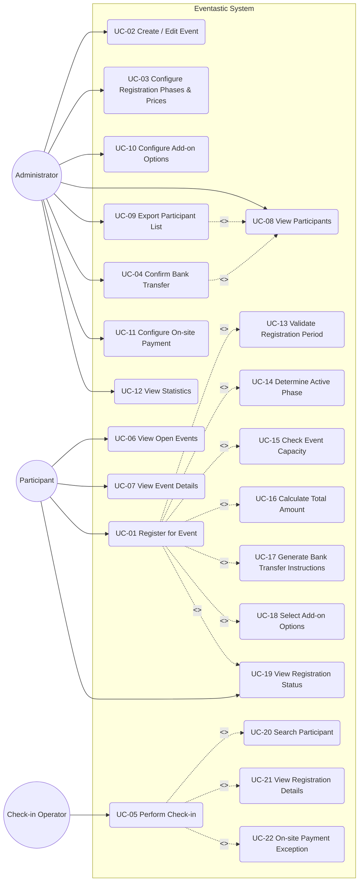

# Use Case View

This page describes the **Use Case View** of the Eventastic backend system, based strictly on the previously defined User Requirements (UR) and System Requirements (SR).

---
## Part 1: Use Case Diagram (Mermaid.js)

## Common Actions (Included Use Cases)

- **UC-13 Validate Registration Period**: Verify the current date/time falls within the event’s overall registration window.
- **UC-14 Determine Active Phase**: Identify the single active registration phase; if none is active, registration is blocked.
- **UC-15 Check Event Capacity**: Enforce capacity using the total number of registrations (pending + paid).
- **UC-16 Calculate Total Amount**: Compute the total based on self-declared student status and selected add-ons.
- **UC-17 Generate Bank Transfer Instructions**: Provide bank transfer details after creating a pending registration.
- **UC-08 View Participants**: Retrieve participant records and registration/payment details for admin workflows.
- **UC-20 Search Participant**: Locate a participant by name, email, or registration reference for check-in.
- **UC-21 View Registration Details**: Show payment status, selected options, and eligibility to check in.

## Use Case Scenarios (Happy Path vs Exception Path)

### UC-01 Register for Event (Participant)

**Happy Path**
- Participant views open events and selects an event.
- System validates the registration period and determines the active phase.
- System checks event capacity using total registrations (pending + paid).
- Participant enters details, self-declares student/non-student status, and optionally selects add-ons.
- System calculates the total amount and creates a registration with **Pending Payment** status.
- System generates bank transfer instructions and provides a confirmation/receipt reference.

**Exception/Alternative Paths**
- Registration is blocked because the overall registration period is closed.
- Registration is blocked because no phase is currently active (phases do not overlap).
- Registration is blocked because capacity is reached based on total registrations (pending + paid).
- Participant omits required fields or provides an invalid email; system requests correction.

### UC-02 Create/Edit Event (Administrator)

**Happy Path**
- Administrator creates a new event or selects an existing event to edit.
- Administrator enters or updates event metadata (title, dates, location, capacity).
- System validates required fields and saves the event.
- Event becomes available for configuration of phases, pricing, and options.

**Exception/Alternative Paths**
- Required fields are missing or invalid (e.g., capacity not positive); system rejects save.
- Event dates conflict with internal constraints (e.g., end date before start date); system requests correction.
- Administrator attempts to reduce capacity below current total registrations; system blocks update.

### UC-03 Configure Registration Phases & Prices (Administrator)

**Happy Path**
- Administrator defines the overall registration period.
- Administrator creates non-overlapping phases and marks exactly one as active at a time.
- Administrator sets student and non-student prices for each phase.
- System validates phase dates and pricing and saves the configuration.

**Exception/Alternative Paths**
- Phases overlap in time; system rejects the configuration.
- No phase is active for the current date; system warns that registration will be blocked.
- Missing price for student or non-student category; system requests completion.

### UC-04 Confirm Bank Transfer (Administrator)

**Happy Path**
- Administrator opens the participant list and filters pending payments.
- Administrator verifies bank transfer proof (outside the system) and selects a registration.
- System updates payment status to **Paid** and records the confirmation timestamp.
- Registration becomes eligible for check-in.

**Exception/Alternative Paths**
- Bank transfer proof is missing or invalid; administrator leaves status as **Pending Payment**.
- Administrator selects a registration already marked **Paid**; system prevents duplicate confirmation.
- Participant record is not found or was deleted; system notifies the administrator.

### UC-05 Perform Check-in (Check-in Operator)

**Happy Path**
- Check-in operator searches for a participant and opens their registration details.
- System verifies the registration is **Paid**.
- Operator marks the participant as checked in; system logs the check-in time.

**Exception/Alternative Paths**
- Registration is **Pending Payment**; system blocks check-in.
- If on-site payment is allowed for the event, operator records a proof note, marks **Paid**, then completes check-in.
- Participant is not found or registration is canceled; system prevents check-in and prompts re-search.
- Participant is already checked in; system prevents duplicate check-in.
